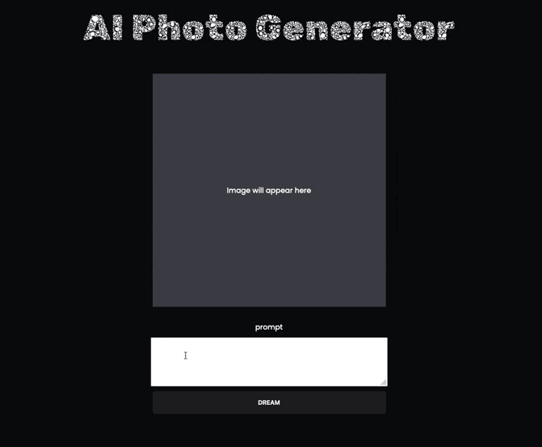

# Image Generator Website
This repository contains a web application that allows users to generate images based on inputted prompts using OpenAI's API. The application is built using Vite, Node.js, and vanilla JavaScript.

## Demo


# Installation
To get started with the project, clone the repository and install the dependencies:
```bash 
git clone https://github.com/your-username/image-generator-website.git
cd image-generator-website
npm install
```
# Usage
To start the development server, run:
```bash
npm run dev
```
This will start the Vite development server and open the application in your default web browser.

# Configuration
To use OpenAI's API, you need to provide your API key. Create a .env file in the root directory of the project and add your OpenAI API key:
```env
OPENAI=your_openai_api_key
```

# License
This project is licensed under the MIT License. See the LICENSE file for details.